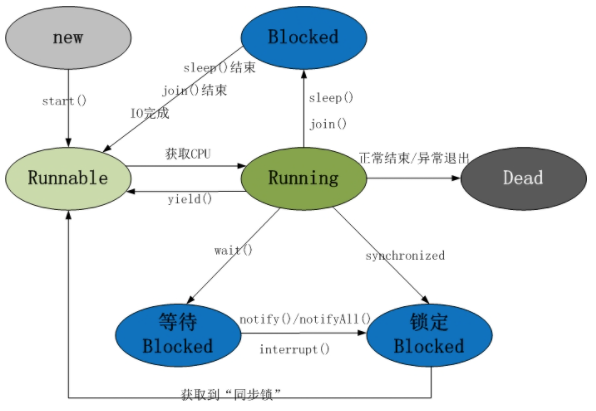

# 1、基础知识

## 1.1 Java多线程

**进程**

> - 分配资源的基本单位
> - 一个进程包含一个或多个线程

**线程**

> - 线程是调度的单位
> - 多线程编程能够使得程序高效利用CPU

### 1.1.1 线程的生命周期

线程是一个动态执行的过程，其生命周期是一个从创建到消亡的过程。

下图为一个线程的完整的生命周期：




**线程的五种状态：**

- **新建状态**

  ​		使用 **new** 关键字和 **Thread** 类或其子类建立一个线程对象后，该线程对象就处于新建状态。它保持这个状态直到程序 **start()** 这个线程。

- **就绪状态**

  ​		当线程对象调用了start()方法之后，该线程就进入就绪状态。就绪状态的线程处于就绪队列中，要**<font color='red'>等待JVM线程调度器</font>**的调度。

- **运行状态**

  ​		如果就绪状态的线程获取 CPU 资源，就可以执行 **run()**，此时线程便处于运行状态。处于运行状态的线程最为复杂，它可以变为**<font color='red'>阻塞状态、就绪状态和死亡状态。</font>**  

  > 问题：何时会总运行状态直接到就绪状态？
  >
  > 当前线程的时间片使用完，则直接切换为就绪状态。

- **阻塞状态**

  ​		如果一个线程执行了sleep（睡眠）、suspend（挂起）等方法，失去所占用资源之后，该线程就从运行状态进入阻塞状态。在睡眠时间已到或获得设备资源后可以重新进入就绪状态。阻塞状态可以分为三种：

  - 等待阻塞：运行状态中的线程执行 wait() 方法，使线程进入到等待阻塞状态；
  - 同步阻塞：线程在获取 synchronized 同步锁失败(因为同步锁被其他线程占用)；
  - 其他阻塞：通过调用线程的 sleep() 或 join() 或发出了 I/O 请求时，线程就会进入到阻塞状态。当sleep() 状态超时，join() 等待线程终止或超时，或者 I/O 处理完毕，线程重新转入就绪状态；

- **死亡状态**

   一个运行状态的线程完成任务或者其他终止条件发生时，该线程就切换到终止状态。


### 1.1.2 线程优先级

> - 每一个Java线程都有一个优先级，有助于CPU确定线程的调度顺序；
> - 优先级为整数，从1到10，1最小，10最大；
> - 1：（Thread.MIN_PRIORITY ）10 ：（Thread.MAX_PRIORITY ）
> - 默认情况下，每一个线程都会分配一个优先级 NORM_PRIORITY（5）；
> - 高优先级会优先分配CPU资源，<font color='red'>但线程优先级不能保证线程执行的顺序</font>


### 1.1.3 创建线程的四种方式

- 通过继承Thread类
- 通过实现Runnable接口
- 通过Callable接口和Future创建线程
- 通过线程池获取线程


#### 1）通过继承Thread类

见代码：com.cafe.ours.ThreadDemo1.java

- 源码：

 ```java
 //Thread类实现了Runnable方法
 public class Thread implements Runnable {}
 ```

- 实现步骤

1、创建类继承Thread

2、重写run方法（run方法中为子线程的逻辑）

3、start后，开启子线程

```java
public class ThreadDemo1 extends Thread{
    private Thread t;
    private String threadName;

    ThreadDemo1(String name) {
        threadName = name;
        System.out.println("Creating " + threadName);
    }

    @Override
    public void run() {
        System.out.println("Running " +  threadName );

        try {
            for (int i = 4; i > 0; i--) {
                System.out.println("Thread: " +  threadName + "," + i);
                Thread.sleep(50);
            }
        } catch (InterruptedException e) {
            System.out.println("Thread " +  threadName + " interrupted.");
        }

        System.out.println("Thread " +  threadName + " exiting.");
    }

    @Override
    public synchronized void start() {
        System.out.println("Starting " +  threadName );
        if (t == null) { //保证线程一定创建
            t = new Thread (this, threadName);
            t.start ();
        }
    }


    public static void main(String[] args) {
        ThreadDemo1 T1 = new ThreadDemo1("线程-1");
        T1.start();
        ThreadDemo1 T2 = new ThreadDemo1("线程-2");
        T2.start();
    }
}
```


> 问题1：start方法是如何开启run方法的？
>
> Thread类中的start方法中调用start0();是一个native方法，在该方法中调用了run方法。类A继承了Tread类，在A中写run方法，就会覆盖掉Thread中的run方法，所以此时调用start方法后，实现的是自己的run方法体里面的代码。
>
> 问题2：为什么我们不能直接调用run()方法？
>
> 如果我们直接调用子线程的run()方法，其方法还是运行在主线程中，代码在程序中是顺序执行的，所以不会有解决耗时操作的问题。所以不能直接调用线程的run()方法，只有子线程开始了，才会有异步的效果。当thread.start()方法执行了以后，子线程才会执行run()方法，这样的效果和在主线程中直接调用run()方法的效果是截然不同的。
>
> 问题3：start()方法和run()方法的区别？
>
> start方法会启动一个线程，调用Runnable对象的run方法，多次启动一个线程没有什么作用。
>
> run方法：只是调用该Runnable对象的run方法，可以重复多次的调用
>


```java
public class ThreadDemo2 implements Runnable{
    private Thread t;
    private String threadName;

    ThreadDemo2( String name) {
        threadName = name;
        System.out.println("Creating " +  threadName );
    }

    @Override
    public void run() {
        System.out.println("Running " +  threadName );
        try {
            for(int i = 4; i > 0; i--) {
                System.out.println("Thread: " + threadName + ", " + i);
                // 让线程睡眠一会
                Thread.sleep(50);
            }
        }catch (InterruptedException e) {
            System.out.println("Thread " +  threadName + " interrupted.");
        }
        System.out.println("Thread " +  threadName + " exiting.");
    }

    public void start () {
        System.out.println("Starting " +  threadName );
        if (t == null) {
            t = new Thread (this, threadName);
            t.start ();
        }
    }

    public static void main(String[] args) {
        ThreadDemo2 R1 = new ThreadDemo2( "Thread-1");
        R1.start();

        ThreadDemo2 R2 = new ThreadDemo2( "Thread-2");
        R2.start();
    }

}
```

#### 2）通过实现Runnable接口

实现步骤：

1、实现Runnable方法

2、重写run方法

3、测试，并start子线程

```java
public class ThreadDemo2 implements Runnable{
    private Thread t;
    private String threadName;

    ThreadDemo2( String name) {
        threadName = name;
        System.out.println("Creating " +  threadName );
    }

    @Override
    public void run() {
        System.out.println("Running " +  threadName );
        try {
            for(int i = 4; i > 0; i--) {
                System.out.println("Thread: " + threadName + ", " + i);
                // 让线程睡眠一会
                Thread.sleep(50);
            }
        }catch (InterruptedException e) {
            System.out.println("Thread " +  threadName + " interrupted.");
        }
        System.out.println("Thread " +  threadName + " exiting.");
    }

    public void start () {
        System.out.println("Starting " +  threadName );
        if (t == null) {
            t = new Thread (this, threadName);
            t.start ();
        }
    }

    public static void main(String[] args) {
        ThreadDemo2 R1 = new ThreadDemo2( "Thread-1");
        R1.start();

        ThreadDemo2 R2 = new ThreadDemo2( "Thread-2");
        R2.start();
    }
}
```

表现：R1、R2两线程交替执行


#### 3）通过Callable接口和Future创建线程

- 实现步骤

1、创建Callable的实现类，并实现call方法，call方法为子线程的执行体，并有返回值

2、创建Callable的实例对象，使用FutureTask对象来包装该对象

3、new一个Thread，并传入futureTask对象作为target，创建启动新线程

4、调用FutureTask对象的get方法，来获取子线程结束后的返回值

- 代码如下

```java
public class CallableThreadTest implements Callable<Integer> {

    @Override
    public Integer call() throws Exception {
        int i = 0;
        for (; i < 100; i++) {
            System.out.println(Thread.currentThread().getName() + " " + i);
        }
        return i;
    }

    public static void main(String[] args) {
        CallableThreadTest ctt = new CallableThreadTest();
        FutureTask<Integer> ft = new FutureTask<>(ctt);
        for (int i = 0; i < 100; i++) {
            System.out.println(Thread.currentThread().getName() + " 的循环变量i的值" + i);
            if (i == 20) {
                new Thread(ft, "有返回值的线程").start();
            }
        }
        try {
            System.out.println("子线程的返回值：" + ft.get());
        } catch (InterruptedException e) {
            e.printStackTrace();
        } catch (ExecutionException e) {
            e.printStackTrace();
        }
    }
}
```

表现：主线程和子线程交叉执行

#### 4）通过线程池获取线程

线程池Executors是一个容纳多个线程的容器，其中的线程可以反复使用，省去了频繁创建线程对象的操作，无需反复创建线程而消耗过多资源。

线程池主要用来解决线程生命周期开销问题和资源不足问题。通过对多个任务重复使用线程，线程创建的开销就被分摊到了多个任务上了，而且由于在请求到达时线程已经存在，所以消除了线程创建所带来的延迟。这样，就可以立即为请求服务，使用应用程序响应更快；另外，通过适当的调整线程中的线程数目可以防止出现资源不足的情况。

```java
public static void main(String[] args) {
    ExecutorService executorService = Executors.newCachedThreadPool();
    executorService.execute(() -> { //使用java8中的lambda方式创建线程体
        try {
            Thread.sleep(2000);
            System.out.println("Thread run");
        } catch (InterruptedException e) {
            e.printStackTrace();
        }
    });
    executorService.shutdownNow();
    System.out.println("Main run");
}
```


### 1.1.4 三种方式的对比

1、采用实现 Runnable、Callable 接口的方式创建多线程时，线程类只是实现了 Runnable 接口或 Callable 接口，还可以继承其他类。

2、使用继承 Thread 类的方式创建多线程时，编写简单，如果需要访问当前线程，则无需使用 Thread.currentThread() 方法，直接使用 this 即可获得当前线程。


## 1.2 多线程一些基本概念

### 1.2.1 线程安全问题

- 产生原因

多个线程竞争同一个资源（访问同一数据）

- 解决方案

  1、run方法内使用：同步代码块 synchronized{}

  ```java
  Public synchronized 返回值类型 方法名（）{} 自动释放对象锁
  ```

  2、使用Lock锁

  ```java
  Lock lock=new ReentranttLock()    // Reentrant（可重用的）
  ```

  Lock 实现提供了比使用 synchronized 方法和语句可获得的更广泛的锁定操作，是 JDK1.5 之后出现的。

  Lock 接口中的方法:

  ```java
  void lock()   // 获取锁 
  void unlock() // 释放锁 
  ```

  Lock 接口的实现类:

  ```java
  java.util.concurrent.locks.ReentrantLock implements Lock
  ```

  使用步骤:

  -  1.在成员位置创建一个 ReentrantLock 对象。
  -  2.在可能出现线程安全问题的代码前，调用 Lock 接口中的方法 lock 获取锁对象。
  -  3.在可能出现线程安全问题的代码后，调用 Lock 接口中的方法 unlock 释放锁对象。

  ```java
  public class RunnableImpl implements Runnable{
      //定义一个共享的票源
      private int ticket = 100;
      //1.在成员位置创建一个ReentrantLock对象
      Lock l = new ReentrantLock();
      //设置线程任务:卖票
      @Override
      public void run() {
          //使用死循环,让卖票重复的执行
          while(true){
              //2.在可能出现线程安全问题的代码前,调用Lock接口中的方法lock获取锁对象
              l.lock();
              //判断票是否大于0
              if(ticket>0){
                  //为了提高线程安全问题出现的几率,让程序睡眠10毫秒
                  try {
                      //可能会产生异常的代码
                      Thread.sleep(10);
                      //进行卖票 ticket--
                      System.out.println(Thread.currentThread().getName()+"正在卖第"+ticket+"张票!");
                      ticket--;
                  } catch (InterruptedException e) {
                      //异常的处理逻辑
                      e.printStackTrace();
                  }finally {
                      //一定会执行的代码,一般用于资源释放(资源回收)
                      //3.在可能出现线程安全问题的代码后,调用Lock接口中的方法unlock释放锁对象
                      l.unlock();//无论程序是否有异常,都让锁对象释放掉,节约内存,提高程序的效率
                  }
              }
          }
      }
  }
  ```


## 1.3 Object类的线程方法

notify() ：通知一个在对象上等待的线程，使其从wait()返回，而返回的前提是该线程获取到了对象的锁。

notifyAll()： 通知所有等待在该对象上的线程。

wait()：调用该方法的线程进入WAITING状态，只有等待另外线程的通知或被中断才会返回，需要注意，

调用wait()方法后，会释放对象的锁。

wait(long) ：超时等待一段时间，这里的参数是毫秒，也就是等待长达n毫秒，如果没有通知就超时返回。

wait(long, int) ： 对于超时时间更细粒度的控制，可以达到毫秒。


### 1.3.1 sleep与wait的区别

1、wait是Object的成员方法，sleep是Thread的静态方法

```java
//wait
public final void wait()  throws InterruptedException
//sleep
public static native void sleep(long millis) throws InterruptedException;
```

2、wait必须在同步代码块中使用，也就是synchronized中，否则会抛异常IllegalMonitorStateException; 而sleep()则不会。

```java
 synchronized (obj) {
     while (<condition does not hold>)
         obj.wait();
     ... // Perform action appropriate to condition
 }
```

3、wait会释放锁，但调用的前提是有锁（即在synchronized同步代码块中）；sleep不会释放锁，也不需要释放锁。

**进一步理解：**

wait(1000)和sleep(1000)的区别：

- sleep(1000)

  未来1000毫秒内，该线程不争夺CPU，1000毫秒后，进入就绪状态，和其它线程一同竞争CPU。

- wait(1000)

  将锁释放1000毫秒，1000毫秒后，如果锁没有被占用，则再次获得锁，wait方法结束，执行后续动作；

  如果锁已经被占用，等其它线程释放锁，直至其它线程notify接触则塞状态，对于设置了超时时间的wait方法，当发生等待超时时，自动接触阻塞，不必其它线程notify它。


## 参考链接

1、[Java 多线程编程]([Java 多线程编程 | 菜鸟教程 (runoob.com)](https://www.runoob.com/java/java-multithreading.html))

